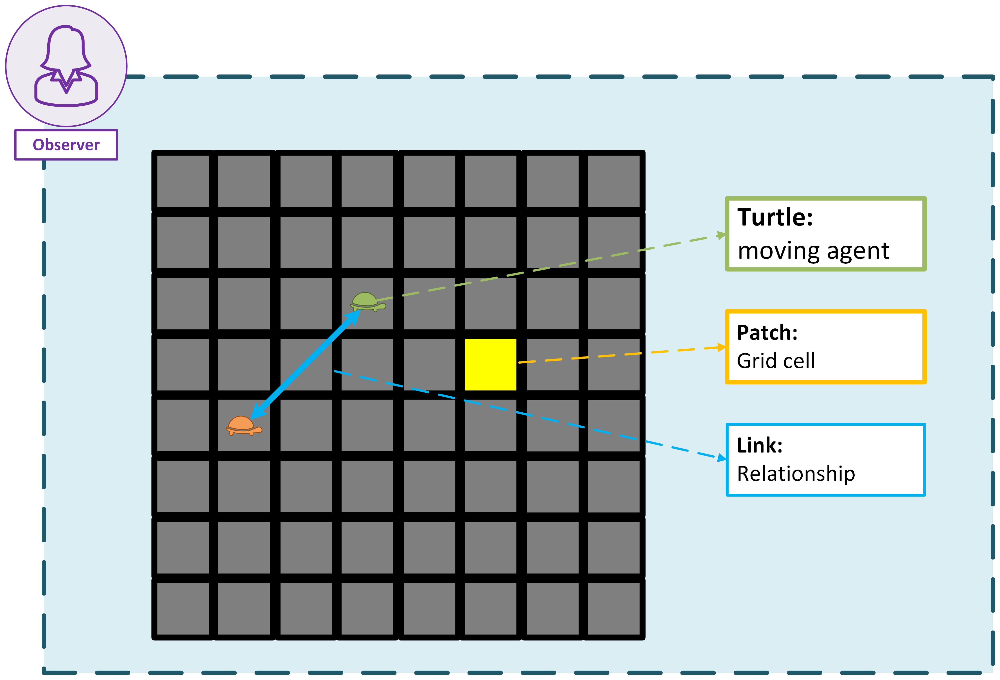

# Agents

Agents are the main actors in NetLogo. They can be **turtles**, **patches**, **links**, or the **observer**. Each agent has its own set of properties and behaviors.

The **turtles** are the most common type of agent. They can move around the **world**, interact with other **turtles**, and change their properties. **Turtles** can also have different shapes and colors, which can be used to represent different types of agents in your model.

The **world** is made up of **patches**, which are the individual squares that make up the 2D grid. Each **patch** can have its own properties, such as color and elevation. **Patches** can also be used to represent different types of terrain or resources in your model. The **turtles** can move around the **patches** and interact with them, which allows you to create complex models of behavior and interaction.

**Links** are a type of agents used to connect **turtles** and represent relationships between them. They can be used to represent social networks, transportation systems, or any other type of connection between agents.

The **observer** is a special agent that can control the simulation and interact with the other agents. The **observer** can create and destroy **turtles**, change the properties of **patches**, and control the flow of the simulation. The **observer** can also be used to create user interfaces, such as buttons and sliders, to control the simulation. It is important to note that the **observer** does not have any properties or behaviors of its own, but it can interact with all other agents in the simulation.



```{note}
When NetLogo is initiate, there are no **turtles** in the **world**. The observer can create **turtles** using the `create-turtles` command. **Patches** can also create **turtles** using the `sprout` command.

Patches can't move, but you can consider them as active agents from the beggining.
```

